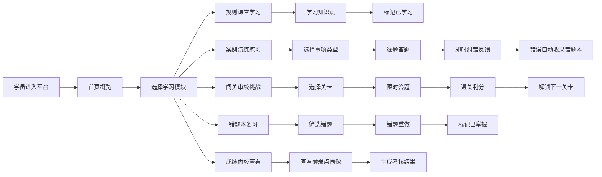

## 1. 产品概述

政务服务事项清单编制演练平台，是面向新入职事项管理员、窗口骨干和政务服务培训班学员的纯前端教学演练系统。通过仿真方式帮助学员学习实施清单编制规则和常见错误识别，将经验型工作转化为可复制的标准化上手流程。

- 核心目标：解决政务服务清单编制学习成本高、错误识别难、经验传承难的痛点
- 目标用户：新入职事项管理员、窗口业务骨干、政务服务培训班学员
- 应用场景：清单编制专项整治前集中培训、单位内部业务能力提升、新人入职岗前实训

## 2. 核心功能

### 2.1 用户角色

| 角色 | 注册方式 | 核心权限 |
|------|----------|----------|
| 学员用户 | 本地存储模拟登录 | 完整使用5大模块功能、查看个人学习数据、收藏优秀示例 |

### 2.2 功能模块

1. **规则课堂**：系统学习清单编制规范，包含受理条件、申请材料、法定依据、承诺时限、材料减免等核心知识点
2. **案例演练**：按事项类型推送练习，模拟填写受理条件和申请材料，判断法定依据支撑性，逐题即时纠错
3. **闯关审校**：限时完成审校任务，识别承诺时限设置不当，练习材料减免情形编写，随机抽取综合编制题
4. **错题本**：自动收集练习错题，支持分类筛选、错题重做、薄弱点分析
5. **成绩面板**：生成个人薄弱点画像，展示学习进度、正确率趋势，输出培训考核结果，支持收藏优秀示例

### 2.3 页面详情

| 页面名称 | 模块名称 | 功能描述 |
|----------|----------|----------|
| 首页 | 导航概览 | 展示5大模块入口、学习进度概览、今日推荐练习、快捷入口 |
| 规则课堂 | 知识点列表 | 分类展示编制规则知识点，支持按主题筛选、进度跟踪、已学习标记 |
| 规则课堂 | 知识点详情 | 图文讲解编制规范，包含正反示例对比、要点提示、相关法规链接 |
| 案例演练 | 练习选择 | 按事项类型（行政许可、行政给付、行政确认等）选择练习主题 |
| 案例演练 | 答题界面 | 仿真填写表单，支持多题型（填空题、判断题、材料减免编写题、法规匹配题） |
| 案例演练 | 即时纠错 | 答题后立即展示正确答案、错误原因、规则依据、知识点链接 |
| 闯关审校 | 关卡选择 | 3个难度关卡，展示通关条件、时间限制、已通关状态 |
| 闯关审校 | 限时答题 | 倒计时计时器，综合题型随机抽取，提交后自动判分 |
| 闯关审校 | 通关结果 | 展示得分、用时、错误分析、解锁下一关卡 |
| 错题本 | 错题列表 | 按错误类型、知识点、练习时间分类筛选，支持重做和标记掌握 |
| 错题本 | 薄弱点画像 | 雷达图展示各知识点掌握程度，推荐针对性练习 |
| 成绩面板 | 学习总览 | 总练习时长、正确率、完成题数、学习天数等核心指标 |
| 成绩面板 | 趋势分析 | 正确率趋势图、各模块完成进度、考核证书生成 |
| 成绩面板 | 我的收藏 | 收藏的优秀示例、典型案例，支持分类管理和分享 |

## 3. 核心流程

## 4. 用户界面设计

### 4.1 设计风格

**设计理念**：政务专业感 + 教学亲和力，采用稳重而不失活力的配色方案，体现政务服务的规范性和教育培训的引导性。

- **主色调**：政务蓝 `#1d4ed8` - 代表专业、规范、可信
- **辅助色**：活力橙 `#f97316` - 用于强调、提醒、进度标识
- **成功色**：翠绿 `#10b981` - 正确答案、通关成功
- **错误色**：玫红 `#ef4444` - 错误提示、需改进项
- **中性色**： slate 色系 - 文本、背景、边框

**字体方案**：
- 标题字体：`"Noto Serif SC", serif` - 端庄大气，体现政务专业性
- 正文字体：`"Noto Sans SC", sans-serif` - 清晰易读，适合长时间学习
- 代码/数据字体：`"JetBrains Mono", monospace` - 用于展示法规条文编号

**视觉元素**：
- 卡片式布局，圆角 `8px`，细微阴影提升层次感
- 渐进式 reveal 动画，页面加载时元素依次入场
- 微交互：按钮悬停上浮、卡片选中边框高亮、答题正确绿色涟漪效果
- 背景：浅灰蓝渐变 + 细微网点纹理，避免单调

### 4.2 页面设计概览

| 页面名称 | 模块名称 | UI 元素 |
|----------|----------|----------|
| 首页 | 导航概览 | 顶部导航栏 + 左侧快捷菜单 + 主区域5大模块卡片 + 右下角悬浮学习助手 |
| 规则课堂 | 知识点列表 | 左侧分类树 + 右侧卡片式知识点列表 + 顶部搜索筛选栏 + 学习进度条 |
| 案例演练 | 答题界面 | 顶部进度指示 + 左侧题干区 + 右侧答题区 + 底部提交/上一题/下一题按钮 |
| 闯关审校 | 限时答题 | 顶部倒计时醒目显示 + 题目区域 + 答题卡进度网格 + 紧急提交提醒 |
| 错题本 | 薄弱点画像 | 雷达图居中展示 + 周围6项能力指标卡片 + 底部推荐练习列表 |
| 成绩面板 | 学习总览 | 顶部数据看板4项核心指标 + 中部趋势折线图 + 底部成就徽章展示 |

### 4.3 响应式

- **桌面优先**：以 1440px 宽度为基准设计，主内容区最大宽度 1280px
- **平板适配**：1024px 以下左侧菜单可收起，卡片改为两列布局
- **触控优化**：按钮最小点击区域 44x44px，表单元素加大内边距便于触控
- **移动端**：768px 以下采用单列布局，底部 Tab 导航替代顶部菜单

### 4.4 动效设计

- **页面入场**：header 先滑入，内容区元素按 100ms 间隔依次淡入上移
- **答题反馈**：正确答案显示时绿色边框脉冲动画 2 次；错误时轻微左右抖动
- **进度变化**：进度条采用平滑过渡动画，时长 300ms
- **弹窗出现**：从触发点缩放 + 淡入，缓动函数 cubic-bezier(0.34, 1.56, 0.64, 1)
- **倒计时**：最后 30 秒数字变红 + 脉冲动画提醒
