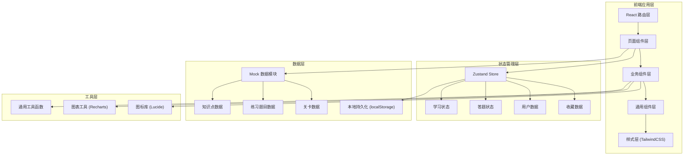
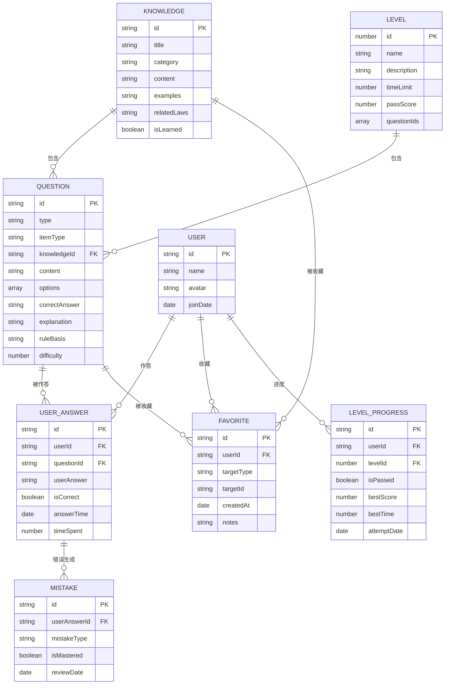

## 1. 架构设计



## 2. 技术描述

- **前端框架**：React 18 + TypeScript 5
- **构建工具**：Vite 5
- **样式方案**：TailwindCSS 3.4
- **状态管理**：Zustand 4.5
- **路由管理**：React Router DOM 6
- **图表库**：Recharts 2.12
- **图标库**：Lucide React 0.424
- **数据持久化**：localStorage + Zustand persist
- **包管理器**：pnpm（优先）/ npm

## 3. 路由定义

| 路由路径 | 页面名称 | 说明 |
|----------|----------|------|
| `/` | 首页 | 平台入口，展示模块导航和学习概览 |
| `/rules` | 规则课堂 - 列表 | 知识点分类列表 |
| `/rules/:id` | 规则课堂 - 详情 | 单个知识点详情页面 |
| `/practice` | 案例演练 - 选择 | 练习类型和事项类型选择 |
| `/practice/:type` | 案例演练 - 答题 | 具体练习答题界面 |
| `/challenge` | 闯关审校 - 关卡 | 关卡选择页面 |
| `/challenge/:level` | 闯关审校 - 答题 | 限时闯关答题界面 |
| `/mistakes` | 错题本 - 列表 | 错题列表和筛选 |
| `/mistakes/analysis` | 错题本 - 薄弱点 | 薄弱点画像分析 |
| `/profile` | 成绩面板 - 总览 | 学习成绩和数据总览 |
| `/profile/favorites` | 成绩面板 - 收藏 | 我的收藏列表 |

## 4. 数据模型

### 4.1 核心数据结构



### 4.2 类型定义

```typescript
// 知识点类型
type KnowledgeCategory = 'acceptCondition' | 'applicationMaterial' | 'legalBasis' | 'promiseTime' | 'materialReduction' | 'commonMistakes';

interface Knowledge {
  id: string;
  title: string;
  category: KnowledgeCategory;
  categoryName: string;
  content: string;
  goodExample: string;
  badExample: string;
  keyPoints: string[];
  relatedLaws: { name: string; article: string }[];
  sortOrder: number;
}

// 题目类型
type QuestionType = 'fillBlank' | 'trueFalse' | 'legalMatch' | 'materialWrite' | 'timeJudge' | 'comprehensive';
type ItemType = 'administrativeLicense' | 'administrativePayment' | 'administrativeConfirmation' | 'administrativeReward' | 'publicService';

interface Question {
  id: string;
  type: QuestionType;
  typeName: string;
  itemType: ItemType;
  itemTypeName: string;
  knowledgeId: string;
  content: string;
  options?: { label: string; value: string }[];
  correctAnswer: string | string[];
  userAnswer?: string | string[];
  explanation: string;
  ruleBasis: string;
  difficulty: 1 | 2 | 3;
  isFavorite?: boolean;
}

// 用户答题记录
interface UserAnswer {
  id: string;
  questionId: string;
  userAnswer: string | string[];
  isCorrect: boolean;
  answerTime: string;
  timeSpent: number;
  mistakeType?: string;
}

// 错题记录
interface MistakeRecord {
  id: string;
  question: Question;
  userAnswer: string | string[];
  mistakeType: string;
  mistakeTypeName: string;
  isMastered: boolean;
  answerTime: string;
  reviewCount: number;
}

// 关卡信息
interface Level {
  id: number;
  name: string;
  description: string;
  timeLimit: number;
  passScore: number;
  totalQuestions: number;
  questionPool: string[];
  isUnlocked: boolean;
  isPassed: boolean;
  bestScore?: number;
  bestTime?: number;
}

// 学习统计
interface LearningStats {
  totalQuestions: number;
  correctCount: number;
  accuracy: number;
  totalTime: number;
  studyDays: number;
  levelProgress: { levelId: number; isPassed: boolean }[];
  categoryAccuracy: { category: string; accuracy: number; total: number }[];
}

// 用户收藏
interface Favorite {
  id: string;
  targetType: 'knowledge' | 'question' | 'example';
  targetId: string;
  targetTitle: string;
  targetContent: string;
  createdAt: string;
  notes?: string;
}
```

## 5. 项目目录结构

```
src/
├── components/          # 通用组件
│   ├── layout/         # 布局组件
│   │   ├── Header.tsx
│   │   ├── Sidebar.tsx
│   │   └── PageLayout.tsx
│   ├── common/         # 基础组件
│   │   ├── Button.tsx
│   │   ├── Card.tsx
│   │   ├── ProgressBar.tsx
│   │   ├── Countdown.tsx
│   │   └── EmptyState.tsx
│   └── business/       # 业务组件
│       ├── QuestionCard.tsx
│       ├── KnowledgeCard.tsx
│       ├── AnswerFeedback.tsx
│       └── RadarChart.tsx
├── pages/              # 页面组件
│   ├── Home/
│   ├── Rules/
│   ├── Practice/
│   ├── Challenge/
│   ├── Mistakes/
│   └── Profile/
├── store/              # 状态管理
│   ├── useUserStore.ts
│   ├── useLearningStore.ts
│   └── usePracticeStore.ts
├── data/               # Mock 数据
│   ├── knowledge.ts
│   ├── questions.ts
│   └── levels.ts
├── types/              # TypeScript 类型定义
│   └── index.ts
├── utils/              # 工具函数
│   ├── storage.ts
│   ├── format.ts
│   └── calculation.ts
├── router/             # 路由配置
│   └── index.tsx
├── App.tsx
├── main.tsx
└── index.css
```

## 6. 状态管理设计

### 6.1 学习状态 Store

```typescript
interface LearningState {
  // 知识点
  knowledgeList: Knowledge[];
  learnedIds: string[];
  
  // 练习记录
  answerRecords: UserAnswer[];
  mistakeRecords: MistakeRecord[];
  
  // 收藏
  favorites: Favorite[];
  
  // 关卡进度
  levelProgress: { levelId: number; isPassed: boolean; bestScore?: number }[];
  
  // 操作方法
  markAsLearned: (id: string) => void;
  addAnswerRecord: (record: UserAnswer) => void;
  addMistake: (mistake: MistakeRecord) => void;
  markMistakeAsMastered: (id: string) => void;
  toggleFavorite: (target: Omit<Favorite, 'id' | 'createdAt'>) => void;
  updateLevelProgress: (levelId: number, data: Partial<LevelProgress>) => void;
  getStats: () => LearningStats;
}
```

### 6.2 练习状态 Store

```typescript
interface PracticeState {
  currentQuestionIndex: number;
  questions: Question[];
  userAnswers: Record<string, string | string[]>;
  isSubmitted: boolean;
  startTime: number | null;
  
  startPractice: (questions: Question[]) => void;
  setAnswer: (questionId: string, answer: string | string[]) => void;
  nextQuestion: () => void;
  prevQuestion: () => void;
  submitAll: () => { correct: number; total: number };
  reset: () => void;
}
```

## 7. 核心功能实现要点

### 7.1 逐题即时纠错
- 每题提交后立即判分，展示正确答案和错误分析
- 错误自动归类到错题本，标记错误类型
- 提供规则依据和关联知识点跳转链接

### 7.2 限时闯关机制
- 使用 `setInterval` 实现倒计时，最后 30 秒视觉提醒
- 随机从题库抽取指定数量题目
- 超时自动提交，计算得分和正确率
- 通关后解锁下一关卡

### 7.3 薄弱点画像
- 按知识点分类统计正确率
- 使用 Recharts 雷达图可视化展示
- 根据薄弱点推荐针对性练习题
- 生成能力评估报告

### 7.4 数据持久化
- 使用 Zustand persist 中间件自动持久化到 localStorage
- 页面刷新后保留学习进度和答题记录
- 支持清空数据重置功能
